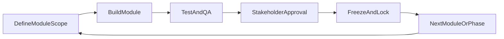
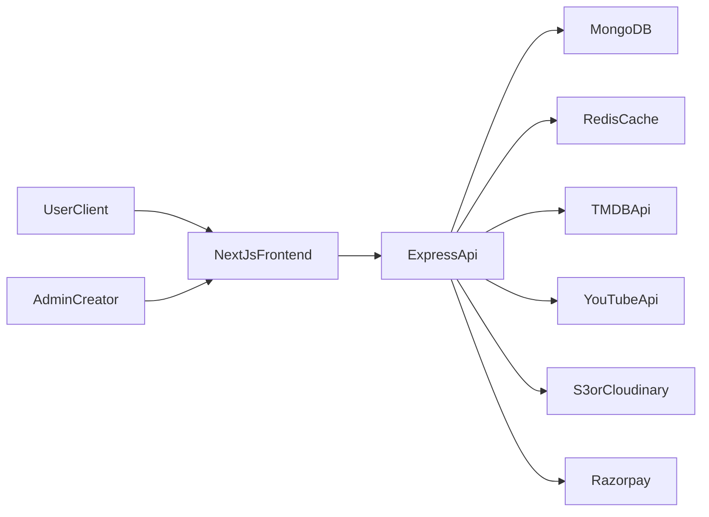

# Mirai Movies AI - Phased Execution Plan (Module Freeze Model)

## Non-Conflict Delivery Model (Mandatory)

- Development follows a strict **build -> test -> approve -> freeze -> move next** lifecycle.
- Once a module is approved, it is marked **LOCKED** and no in-place edits are allowed in later phases.
- Any new requirement after freeze must be implemented as:
  - a new extension module, or
  - a versioned successor (`v2`) scheduled in a future phase.
- Freeze records are maintained in `docs/freeze-registry.md` with:
  - module name, owner, approval date, commit/tag, test report, and lock scope.
- Every phase has an explicit freeze gate; next phase starts only after all gate modules are locked.




## Architecture and Repository Strategy

- Use a monorepo with `apps/frontend` (Next.js App Router) and `apps/backend` (Express API), plus `packages/shared` for reusable types/schemas.
- Keep strict module boundaries so Phase 2 can be added without breaking Phase 1 features.
- Core runtime services:
  - Frontend SSR/ISR pages for SEO and performance.
  - Backend REST API + background jobs.
  - MongoDB for transactional app data.
  - Redis for caching/session/rate-limit counters.
  - S3/Cloudinary + HLS pipeline for OTT media.




## Phase 0 (Foundation Freeze)

- Goal: finalize engineering baseline once and lock it before product modules start.

### Modules to Complete and Freeze

- `M0.1` Monorepo and folder conventions.
- `M0.2` Shared code standards (lint/format/validation contracts).
- `M0.3` Environment management and secrets policy.
- `M0.4` CI baseline (test + build checks).
- `M0.5` Role model and auth contract skeleton (`user`, `creator`, `admin`).

### Freeze Gate (Phase 0 -> 1)

- All baseline modules marked LOCKED in `docs/freeze-registry.md`.
- No structural changes to repo layout after this point.

## Phase 1 (Core Platform Freeze: Discovery + Legal Aggregation + Monetization Base)

- Goal: launch legal discovery + aggregation + free hub + auth + baseline monetization.

### 1) Monorepo Scaffold and Shared Standards

- Create folder structure and baseline tooling:
  - `apps/frontend`
  - `apps/backend`
  - `packages/shared`
  - `infra` (docker/dev scripts)
  - `docs` (API, monetization, legal compliance)
- Add env templates and validation contracts for both apps.

### 2) Backend Foundation (Express + MongoDB)

- Implement modular backend domains:
  - `auth`, `users`, `movies`, `providers`, `freehub`, `reviews`, `affiliate`, `ads`, `analytics`, `admin`, `blog`.
- Set up JWT auth with refresh tokens, RBAC roles (`user`, `creator`, `admin`).
- Add request validation, centralized error handling, structured logging, and rate limiting.

### 3) MongoDB Schema (Phase 1 collections)

- Core collections:
  - `users`, `profiles`, `sessions`, `roles`
  - `movies`, `movieCredits`, `movieTrailers`, `movieAvailability`
  - `reviews`, `comments`
  - `watchlists`, `favorites`, `watchHistory`
  - `freeVideos` (YouTube/public domain metadata)
  - `affiliateClicks`, `adImpressions`, `adEvents`
  - `blogPosts`, `blogCategories`, `sponsors`
  - `auditLogs`, `featureFlags`
- Add indexes for search and SEO pages (title/slug/genre/provider/date).

### 4) API Surface (Phase 1)

- Auth:
  - `POST /api/v1/auth/register`
  - `POST /api/v1/auth/login`
  - `POST /api/v1/auth/refresh`
  - `POST /api/v1/auth/logout`
- Movies/discovery:
  - `GET /api/v1/movies/trending`
  - `GET /api/v1/movies/popular`
  - `GET /api/v1/movies/upcoming`
  - `GET /api/v1/movies/search`
  - `GET /api/v1/movies/:id`
- Streaming providers + affiliate:
  - `GET /api/v1/movies/:id/watch-providers`
  - `POST /api/v1/affiliate/click`
  - `GET /r/:code` (tracked redirect)
- Free hub:
  - `GET /api/v1/free-movies`
  - `GET /api/v1/free-movies/:id`
- Reviews:
  - `GET /api/v1/movies/:id/reviews`
  - `POST /api/v1/movies/:id/reviews`
- Blog/SEO:
  - `GET /api/v1/blog/posts`
  - `GET /api/v1/blog/posts/:slug`
- Admin:
  - `GET /api/v1/admin/analytics/overview`
  - CRUD for free videos/blog/sponsors/users.

### 5) Frontend (Next.js App Router + Tailwind + Framer Motion)

- Build pages:
  - `/` Home (hero, trending/popular/upcoming)
  - `/movie/[slug]` Movie details + trailer + where-to-watch
  - `/search` AI-style semantic search UI
  - `/free-movies` legal free content categories
  - `/blog` and `/blog/[slug]`
  - `/dashboard` (user profile, watchlist, history)
  - `/admin` analytics/content management
- Implement reusable Netflix-style components: hero banner, rows, hover cards, sticky header, skeleton loaders.

### 6) AI Discovery (Phase 1 pragmatic)

- Hybrid recommendation service:
  - TMDB similarity + genre/mood keyword mapping + collaborative signals from watch history.
- Endpoint example:
  - `POST /api/v1/recommendations/query` with prompt like “movies like Interstellar”.

### 7) SEO and Growth Engine (Phase 1)

- SSR/ISR for movie + blog pages.
- Dynamic metadata, OpenGraph, schema.org `Movie` and `Article` markup.
- Generate keyword landing pages (`where-to-watch-[movie]`, `best-movies-[year]`).

### 8) Monetization Integration Points (Phase 1)

- Ad slots architecture (AdSense-ready placeholders + consent flow).
- Affiliate tracking and attribution model (source, campaign, provider).
- Sponsored content pipeline in blog CMS (sponsor tags + disclosures).
- Razorpay groundwork:
  - store plans/customers/subscription state in MongoDB, but keep paywall optional until Phase 2 activation.

### 9) Security, Compliance, and Legal Guardrails

- Content policy checks: only official provider links and authorized/official YouTube/public domain entries.
- Audit trail for admin changes and affiliate edits.
- Privacy policy, terms, cookie consent, and takedown workflow.

### 10) Deployment (Phase 1)

- Frontend to Vercel, backend to Render, MongoDB Atlas managed cluster.
- CI/CD with branch previews, migration scripts, health checks, and uptime alerts.

### Freeze Gate (Phase 1 -> 2)

- Lock modules independently after approval:
  - `M1.A` Auth + User core
  - `M1.B` Movie discovery + details
  - `M1.C` Streaming providers + affiliate redirect
  - `M1.D` Free legal movie hub
  - `M1.E` Reviews/comments
  - `M1.F` Blog + SEO engine
  - `M1.G` Admin basics + analytics overview
  - `M1.H` Monetization baseline (ads slots + sponsored content support)
- Only defect fixes are allowed for locked modules; enhancements go to Phase 2+ extension modules.

## Phase 2 (Premium OTT Freeze: Subscription + HLS + Advanced Intelligence)

- Goal: activate subscription OTT and deepen retention/revenue.

### 1) OTT Content Management and Streaming

- Creator/admin upload flow to S3/Cloudinary.
- Transcoding + HLS packaging pipeline (worker queue).
- Secure playback URLs, DRM-ready abstraction, geo-constraints (if needed).

### 2) Premium Membership Activation (Razorpay)

- Enable recurring subscriptions (`Basic`, `Pro`, `Family`) with INR pricing.
- Entitlements middleware for ad-free + exclusive catalog.
- Webhooks for payment state reconciliation and renewal handling.

### 3) Advanced Viewer Features

- Continue watching across devices.
- Multi-device session management.
- Smart watchlist notifications (new availability, price drop, new season).

### 4) AI Upgrade

- Personalized ranker using behavioral events.
- Contextual recommendation widgets per page type (detail, search, home).

### 5) Analytics Monetization Readiness

- Build anonymized insights dashboards for internal use.
- Create export layer for future B2B insight products.

### 6) PWA and Performance Enhancements

- Offline-ready shell, install prompt, caching strategy.
- Improve Core Web Vitals and ad-performance balancing.

### Freeze Gate (Phase 2 -> 3)

- Lock modules after validation:
  - `M2.A` Upload + transcoding + HLS playback
  - `M2.B` Razorpay subscriptions + webhook reconciliation
  - `M2.C` Entitlement/paywall middleware
  - `M2.D` Continue watching + multi-device sessions
  - `M2.E` Personalized ranking v1

## Phase 3 (Growth and Optimization Freeze)

- Goal: stabilize traffic and revenue optimization modules without disturbing core product modules.
- Modules:
  - `M3.A` SEO expansion pages and internal linking automation
  - `M3.B` Performance optimization and cache strategy
  - `M3.C` PWA shell and offline strategy
  - `M3.D` Advanced revenue analytics dashboards

### Freeze Gate (Phase 3 -> 4)

- All growth modules locked with measurable KPI deltas and rollback notes.

## Phase 4 (Scale Extensions Only)

- Goal: new capability growth without touching frozen foundations.
- Allowed work types:
  - New region/language packs
  - New recommendation model versions
  - New affiliate/provider integrations
  - New premium bundles/features as separate extension modules
- Rule: no edits to locked module internals; integrate through stable interfaces only.

## Suggested Initial Folder Structure

- `[C:/Users/yunus/OneDrive/Desktop/Movies-website/apps/frontend](C:/Users/yunus/OneDrive/Desktop/Movies-website/apps/frontend)`
- `[C:/Users/yunus/OneDrive/Desktop/Movies-website/apps/backend](C:/Users/yunus/OneDrive/Desktop/Movies-website/apps/backend)`
- `[C:/Users/yunus/OneDrive/Desktop/Movies-website/packages/shared](C:/Users/yunus/OneDrive/Desktop/Movies-website/packages/shared)`
- `[C:/Users/yunus/OneDrive/Desktop/Movies-website/docs](C:/Users/yunus/OneDrive/Desktop/Movies-website/docs)`
- `[C:/Users/yunus/OneDrive/Desktop/Movies-website/infra](C:/Users/yunus/OneDrive/Desktop/Movies-website/infra)`

## Freeze and Change-Control Rules

- Lock declaration format:
  - `LOCKED: <module-id> | <phase> | <approved-by> | <date> | <tag>`
- Post-freeze change policy:
  - `P0/P1 bug`: hotfix branch allowed, must keep API/schema backward compatibility.
  - Feature requests: must be scheduled as new module in next phase.
  - Breaking changes: only allowed in explicit versioned module (`/v2`) with migration plan.
- Required artifacts before lock:
  - test report, API contract snapshot, schema snapshot, rollback checklist.

## Phase Exit Criteria

- Phase 0 done when foundation modules are approved and structurally locked.
- Phase 1 done when legal discovery ecosystem, affiliate tracking, ad architecture, SEO pages, auth, admin basics, and stable deployment are live and locked.
- Phase 2 done when OTT upload-to-HLS pipeline, Razorpay premium entitlements, and advanced personalization are production-stable and locked.
- Phase 3 done when SEO/performance/PWA/analytics optimization modules are benchmarked and locked.

## Risks and Mitigations

- API quota limits (TMDB/YouTube): add caching + fallback jobs.
- Legal compliance drift: enforce provider whitelist and review workflow.
- Video infra cost spikes: tiered transcoding presets + lifecycle storage policies.
- SEO volatility: content cadence + schema validation + internal linking strategy.

## Module-by-Module Execution Checklist (Sequential Lock Workflow)

Use this checklist in order. Start the next module only after the current module is approved and frozen.

### Phase 0 Checklist (Foundation Freeze)

- `M0.1` Monorepo scaffold complete (`apps/frontend`, `apps/backend`, `packages/shared`, `docs`, `infra`)
- `M0.1` Build and lint pass in CI
- `M0.1` Approval received
- `M0.1` Lock record added
- `M0.2` Shared standards (lint, format, validation conventions) finalized
- `M0.2` Team review complete
- `M0.2` Approval received
- `M0.2` Lock record added
- `M0.3` Env strategy and secrets policy documented
- `M0.3` `.env.example` contracts finalized
- `M0.3` Approval received
- `M0.3` Lock record added
- `M0.4` CI baseline active (test/build gates)
- `M0.4` Pipeline green on main branch
- `M0.4` Approval received
- `M0.4` Lock record added
- `M0.5` Auth role contract skeleton finalized (`user`, `creator`, `admin`)
- `M0.5` Contract tests pass
- `M0.5` Approval received
- `M0.5` Lock record added

### Phase 1 Checklist (Core Platform Freeze)

- `M1.A` Auth + user core complete
- `M1.A` Security checks and token lifecycle tests pass
- `M1.A` Approval + lock
- `M1.B` Movie discovery + movie details complete
- `M1.B` TMDB integration tests pass
- `M1.B` Approval + lock
- `M1.C` Streaming providers + affiliate redirect complete
- `M1.C` Click attribution and redirect logs validated
- `M1.C` Approval + lock
- `M1.D` Free legal hub complete (YouTube/public domain only)
- `M1.D` Legal source whitelist validation pass
- `M1.D` Approval + lock
- `M1.E` Reviews/comments complete
- `M1.E` Moderation and abuse-protection checks pass
- `M1.E` Approval + lock
- `M1.F` Blog + SEO engine complete
- `M1.F` Metadata/schema and indexing checks pass
- `M1.F` Approval + lock
- `M1.G` Admin basics + analytics overview complete
- `M1.G` RBAC checks pass
- `M1.G` Approval + lock
- `M1.H` Monetization baseline complete (ad slots, sponsored flags)
- `M1.H` Revenue event tracking checks pass
- `M1.H` Approval + lock

### Phase 2 Checklist (Premium OTT Freeze)

- `M2.A` Upload + transcoding + HLS playback complete
- `M2.A` Playback stability and fallback tests pass
- `M2.A` Approval + lock
- `M2.B` Razorpay subscriptions + webhooks complete
- `M2.B` Payment state reconciliation tests pass
- `M2.B` Approval + lock
- `M2.C` Entitlement/paywall middleware complete
- `M2.C` Access control matrix checks pass
- `M2.C` Approval + lock
- `M2.D` Continue watching + multi-device session complete
- `M2.D` Cross-device sync tests pass
- `M2.D` Approval + lock
- `M2.E` Personalized ranker v1 complete
- `M2.E` Recommendation quality baseline verified
- `M2.E` Approval + lock

### Phase 3 Checklist (Growth Freeze)

- `M3.A` SEO expansion and internal linking automation complete
- `M3.A` Ranking/indexing validation pass
- `M3.A` Approval + lock
- `M3.B` Performance optimization and caching complete
- `M3.B` Core Web Vitals targets achieved
- `M3.B` Approval + lock
- `M3.C` PWA shell and offline strategy complete
- `M3.C` Install/offline behavior validation pass
- `M3.C` Approval + lock
- `M3.D` Advanced analytics dashboards complete
- `M3.D` Metrics integrity checks pass
- `M3.D` Approval + lock

### Lock Record Template

Use this for every approved module in `docs/freeze-registry.md`.

```md
LOCKED: <module-id> | <phase> | <approved-by> | <date> | <tag>
- Scope: <files/services owned by module>
- Test report: <link/path>
- API/schema snapshot: <link/path>
- Rollback plan: <link/path>
```

